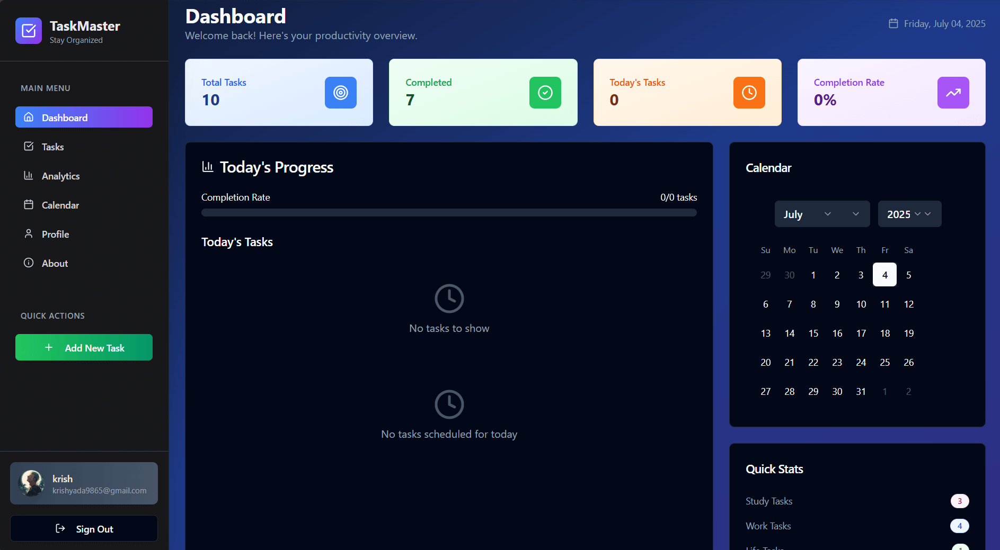

<h1 align="center">✅ TaskMaster - Your Ultimate Productivity Companion 🚀</h1>

<p align="center">
  
</p>

<p align="center">
  A sleek, powerful, and user-friendly task management application designed to supercharge your productivity.  
  <br />
  Built with modern web technologies like React, TypeScript, Tailwind, and Shadcn UI.  
</p>

---

## 🌟 What is TaskMaster?

**TaskMaster** is your go-to tool for managing daily tasks with ease and style. Whether you're juggling work, personal projects, or life goals, **TaskMaster** empowers you to stay organized, prioritize effectively, and celebrate your achievements.

With a **modern design** and **smart features**, it’s the perfect companion for anyone looking to master their tasks! 💪

---

## ✨ Key Features

- ✅ **Robust Task Management**  
  Assign priorities, set deadlines, and reorder tasks with drag-and-drop.

- 🎨 **Beautiful & Responsive Design**  
  Light, Dark, and System themes – optimized for all screen sizes.

- 📊 **Analytics & Achievements**  
  View progress with charts and unlock motivational milestones.

- 🔔 **Smart Notifications**  
  Get timely reminders to stay on track.

- 👤 **Personalized User Profiles**  
  Customize your preferences and identity.

- 📅 **Interactive Calendar**  
  Plan your days using a beautiful calendar view.

---

## 🛠️ Tech Stack

| Technology       | Role                                         |
|------------------|----------------------------------------------|
| ⚛️ React 18+       | Frontend UI framework                        |
| 📘 TypeScript     | Type-safe coding for better reliability      |
| 🎨 Tailwind CSS   | Utility-first CSS for clean styling          |
| 🧩 Shadcn UI      | Beautiful reusable UI components             |
| 🌈 Lucide Icons   | Lightweight and modern icon set              |
| 📅 date-fns       | Elegant date handling and formatting         |
| ⚡ Vite           | Fast build tool and development server       |

---

## 📂 Project Structure

```

📁 public/                   → Static assets (images, favicon, etc.)
📁 src/
├── 📁 components/           → Reusable UI components
│   ├── ✅ tasks/            → Task management components
│   ├── 📅 calendar/         → Interactive calendar components
│   ├── 📊 analytics/        → Progress and achievements
│   └── 🧩 ui/               → Shared UI components (Shadcn)
├── 📁 hooks/                → Custom React hooks
├── 📁 utils/                → Utility functions
├── ⚛️ App.tsx               → Main application component
└── 🚀 main.tsx              → Vite entry point

📦 package.json              → Project dependencies
⚙️ vite.config.ts            → Vite configuration
🎨 tailwind.config.ts        → Tailwind theme configuration
📘 tsconfig.json             → TypeScript config

````

---

## 🚀 Get Started

### 1. Clone the Repository  
```bash
git clone https://github.com/krishyadav90/TaskMaster.git
cd TaskMaster
````

### 2. Install Dependencies

```bash
npm install
```

### 3. Run the Development Server

```bash
npm run start
```

Then, open 👉 [http://localhost:5173](http://localhost:5173) in your browser!

---

## 🔐 Environment Variables (Optional)

If you're integrating external services (notifications, APIs, etc.), create a `.env` file:

```env
VITE_API_URL=https://your-api-endpoint
VITE_API_KEY=your-api-key
```

---

## 📜 License

This project is licensed under the **MIT License**.

✅ You can:

* Use it personally or commercially
* Modify and distribute it
* Integrate it into your projects
* Sell modified versions

⚠️ You must:

* Include the original license and credit
* Acknowledge **Krish Yadav** as the creator

🛑 No warranties are provided. Use at your own risk.

---

## 🤝 How to Contribute

We love contributors! Here's how you can help:

```bash
# Fork this repo
# Create a feature branch
git checkout -b feature/your-feature-name

# Commit and push
git commit -m "Add awesome feature"
git push origin feature/your-feature-name
```

Then open a **Pull Request** with a clear description.
🐛 Found a bug or want a new feature? [Open an Issue](https://github.com/krishyadav90/TaskMaster/issues)

---

## 💡 Developer’s Note

Hey! I’m **Krish Yadav** 👋, the creator of TaskMaster.

I built this app to make productivity **fun, beautiful, and easy**.
I encourage you to:

* 🔧 Customize it for your needs
* 🌟 Use it as a learning project
* 🤝 Collaborate and contribute
* 🧠 Suggest ideas for new features

---

## 📬 Contact

**Developer**: Krish Yadav
📧 Email: [krishyada9865@gmail.com](mailto:krishyada9865@gmail.com)
🔗 GitHub: [@krishyadav90](https://github.com/krishyadav90)
📄 License: MIT

---

<p align="center">
  🌟 <strong>TaskMaster</strong> — Organize, prioritize, and conquer your tasks with ease.  
  <br />
  Built with ❤️ by <strong>Krish Yadav</strong>
</p>

